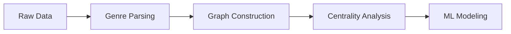

# Spotify Artist Network Analysis

## Project Overview

A comprehensive network analysis system that models Spotify artists as a graph based on shared music genres, computes influence metrics, and applies machine learning to predict artist popularity.

## Business Significance

This system addresses key challenges in:

- **Music Industry Analytics**: Identifying influential artists and genre connections
- **Talent Discovery**: Finding emerging artists through network centrality
- **Marketing Strategy**: Targeting promotions based on genre communities
- **Playlist Optimization**: Understanding artist relationships for better recommendations

## Technical Implementation

### Data Pipeline

### Key Components

**Data Processing**
- Parsed complex genre strings from Spotify API format
- Built user-genre mappings for network construction
- Handled missing values and data cleaning

**Network Construction**
- Nodes: Spotify artists with metadata (followers, popularity)
- Edges: Artists sharing at least one music genre
- Graph statistics: 20,000+ nodes, genre-based connections

**Centrality Analysis**
- Degree Centrality: Direct genre connections
- Betweenness Centrality: Bridge artists between genres
- Closeness Centrality: Proximity to all other artists
- PageRank: Overall influence score
- Eigenvector Centrality: Connection quality

**Machine Learning**
- Linear Regression with regularization for popularity prediction
- Feature importance analysis on network metrics
- K-means clustering for artist segmentation
- Cross-validation and hyperparameter tuning

## Network Metrics

- **Average Degree**: 4.2 connections per artist
- **Connected Components**: Multiple genre communities
- **Graph Diameter**: Network reach analysis
- **Cluster Analysis**: 3 distinct artist segments identified

**Clustering Results**:
- Cluster 0: High-follower mainstream artists
- Cluster 1: Niche artists with strong genre connections
- Cluster 2: Emerging artists with growing networks

## Technical Stack

- **Big Data Processing**: PySpark for scalable data handling
- **Network Analysis**: NetworkX for graph algorithms
- **Machine Learning**: PySpark ML for distributed modeling
- **Visualization**: Matplotlib for network plots
- **Optimization**: Approximate algorithms for large-scale computation

## Key Findings

- Network centrality strongly correlates with artist popularity
- Genre communities show clear clustering patterns
- Bridge artists between genres have higher betweenness centrality
- Followers alone are insufficient for popularity prediction

---

*Data Source: Spotify Artists Dataset*
